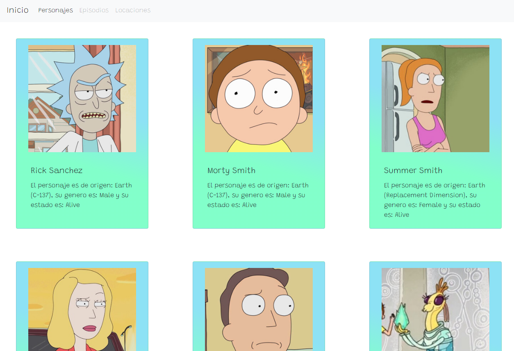
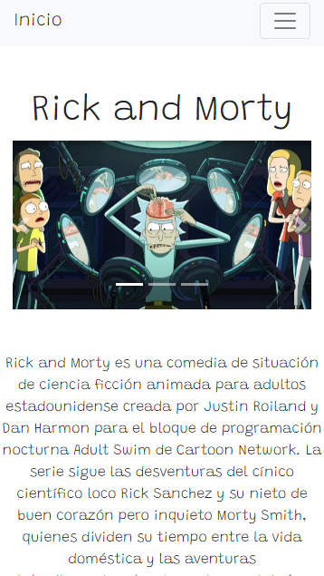

# Rick y Morty API 👨‍🔬🧪

Creación de sitio web de Rick y Morty, donde se hace una conexión xmlHttpRequest a la API. Features en <a href="https://gitlab.com/gonzalolamas/rick-and-morty-api">GitLab</a>.

# Screenshots

<h4>Diseño web<h4>

<h4>Diseño mobile<h4>

# Tecnologías

<ul>
    <li>HTML</li>
    <li>CSS</li>
    <li>Bootstrap</li>
    <li>JavaScript</li>
</ul>
    
# Deploy
<a href="https://rick-y-morty-gonzalo.vercel.app/">Vercel</a>

